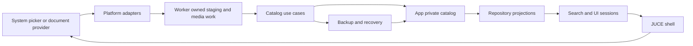

# Architecture

## Purpose and authority

Shuba is a local-first, single-device Android catalog for personal resale items. The design optimizes for understandable C++23 ownership, recoverable local data, and a small Android integration surface. The first-version operating envelope is approximately 500 items and 3,000 photos; it is a sizing assumption for design and acceptance, not a performance guarantee. The product does not provide cloud synchronization, shared catalogs, marketplace automation, image classification, advanced accounting, SQL storage, broad media-library access, or direct camera capture.

The supported implementation baseline is C++23 with JUCE for UI/platform integration, Glaze for persisted JSON data, and libjxl for internal image media. Add another dependency only when it materially avoids custom infrastructure, remains isolated behind a small interface, does not expand the product boundary, and does not materially complicate the Android build. If a future Unicode requirement cannot be served by JUCE, select one maintained UTF library behind the same narrow-boundary rule rather than embedding ad hoc conversion code. Linux host/headless testing is maintained for development confidence, but a desktop product or desktop-specific UI adaptation is not a goal; expand desktop support only when it remains demonstrably low-cost and does not distort Android ownership.

This document records durable constraints that are difficult to reconstruct from individual files. It does not replace code contracts. For a behavior change, consult the owning public header and its focused tests first:

| Area | Live authority |
| --- | --- |
| Domain records and validation | [`Source/Domain/Domain.hpp`](../Source/Domain/Domain.hpp:14) |
| Catalog projections and use cases | [`Source/Catalog`](../Source/Catalog) |
| File schema and persistence | [`Source/Persistence`](../Source/Persistence) |
| Platform interfaces and Android implementations | [`Source/Platform/PlatformServices.hpp`](../Source/Platform/PlatformServices.hpp:16) and [`Source/Platform/JuceAndroidServices.hpp`](../Source/Platform/JuceAndroidServices.hpp:7) |
| Startup and workflow state | [`Source/UI/Session`](../Source/UI/Session) |
| JUCE application shell and rendering | [`Source/UI/AppShell.hpp`](../Source/UI/AppShell.hpp:61) and [`Source/UI/Screens`](../Source/UI/Screens) |
| English/Russian presentation | [`Source/Localization`](../Source/Localization) |

## Layering and ownership

- [`Source/Core`](../Source/Core) contains small value types, IDs, clocks, result/diagnostic types, and operation serialization. It must not acquire JUCE widget, Android, or catalog UI dependencies.
- [`Source/Domain`](../Source/Domain) defines business records and pure validation/derivation. It must not perform file, picker, codec, or UI work.
- [`Source/Persistence`](../Source/Persistence) owns the serialized schema, line-oriented load/write behavior, catalog-container layout, previous copies, and recovery artifacts. It must not contain UI policy.
- [`Source/Catalog`](../Source/Catalog) composes repository projections and application use cases for search, media import/export, backup, and catalog replacement. It depends on abstract platform services rather than Android/JUCE classes.
- [`Source/Platform`](../Source/Platform) defines abstract boundaries. Linux fakes support host tests; JUCE/Android classes implement the platform-facing services.
- [`Source/UI/Session`](../Source/UI/Session) converts user workflows into use-case requests and session state. Session code is intentionally JUCE-widget-free.
- [`Source/UI/View`](../Source/UI/View) and [`Source/UI/Screens`](../Source/UI/Screens) render read-only projections and route user intent. Widgets must not own persistence or business rules.
- [`Source/UI/AppShell.hpp`](../Source/UI/AppShell.hpp:61) is the persistent JUCE composition root. It owns shell state, platform service instances, route coordination, progress presentation, and teardown.

A feature should remain within its narrowest owning layer. Do not solve a persistence rule in a screen renderer, copy platform behavior into a use case, or make a worker read mutable editor/component state.

## Domain model

### Records and lifecycle

[`ItemRecord`](../Source/Domain/Domain.hpp:157) represents a resale item. It has a required display name and category, optional storage assignment, tags/notes, status, listing data, acquisition data, finance data, and timestamps. [`StorageRecord`](../Source/Domain/Domain.hpp:174) represents a physical or conceptual container; its visual type is data, not a hard-coded subtype, and it may have an optional parent storage.

Items use [`ItemStatus`](../Source/Domain/Domain.hpp:22): draft, planned, listed, sold, or archived. Storages use [`StorageLifecycleStatus`](../Source/Domain/Domain.hpp:34): active or archived. Archive is a business state: it retains metadata and media, remains visible to diagnostics/backup/explicit searches, and is not a substitute for unsafe deletion.

[`PhotoRecord`](../Source/Domain/Domain.hpp:197) is the canonical link from a photo to an item or storage. Do **not** add persisted owner-side photo ID lists; the repository derives ordered owner projections from photo records. A photo may be marked main and has an explicit sort order. Internal media identity derives from the stable photo ID.

Tags are lightweight key/value rows. UI-created blank keys are rejected. Existing blank keys can remain readable as compatibility data but do not generate tag-key hints; see [`validate_tag_for_ui_save()`](../Source/Domain/Domain.hpp:229) and [`validate_existing_tag_row()`](../Source/Domain/Domain.hpp:231).

[`MoneyAmount`](../Source/Domain/Domain.hpp:88) stores integer units, scale, and currency; use the parsing, normalization, rendering, and same-currency profit helpers rather than floating-point calculations.

### Derived state is not canonical state

[`CatalogRepositoryState`](../Source/Catalog/CatalogRepository.hpp:179) derives indexes, storage paths, parent/owner reference health, photo presence, default visibility, diagnostics, orphan-media observations, and search projections. UI and search consume those projections rather than reproducing relationship logic.

Broken references and missing media must remain diagnosable rather than silently repaired. A usable projection can be built from degraded data, but it must retain warning state and recovery information.

## Catalog persistence and recovery

### App-private layout

The path names are intentionally centralized in [`MetadataSchema.hpp`](../Source/Persistence/MetadataSchema.hpp:14), [`JsonlCatalog.hpp`](../Source/Persistence/JsonlCatalog.hpp:14), and [`CatalogStorage.hpp`](../Source/Persistence/CatalogStorage.hpp:16). The active catalog contains:

- `manifest.json` with catalog identity, layout, and feature declarations;
- `settings.json` with the small persisted settings scope;
- `data/items.jsonl`, `data/storages.jsonl`, and `data/photos.jsonl` as current-state entity tables;
- `media/photos` containing internal `.jxl` media;
- `recovery` reports and quarantined invalid JSONL lines; and
- `backup/previous-data-copies` for retained pre-write metadata copies.

The app-private container also separates the active catalog, full-catalog rollback copies, and operation temporary files through [`CatalogContainerLayout`](../Source/Persistence/CatalogStorage.hpp:30). Do not place canonical media in a public/shared directory.

### Schema compatibility

[`ManifestRecord`](../Source/Persistence/MetadataSchema.hpp:124) and [`SettingsRecord`](../Source/Persistence/MetadataSchema.hpp:144) are singleton JSON documents. Item, storage, and photo records use one JSON object per JSONL line. This allows tolerant loading and localized quarantine rather than all-or-nothing parsing.

[`EntityEnvelope`](../Source/Persistence/MetadataSchema.hpp:84) preserves top-level unknown fields for item, storage, and photo records through a map of raw JSON values. This is a forward-compatibility boundary, not permission to partially reinterpret malformed known nested values. Preserve opaque unknown values on read/write; add a schema migration only when the project can define and test the conversion.

### Writes, loading, and fatal states

Metadata changes pass through [`commit_metadata_file()`](../Source/Persistence/CatalogStorage.hpp:105): validate serialized text, write a temporary sibling, retain a bounded previous copy when requested, atomically replace the canonical file, and report cleanup warnings. The default retention for individual metadata-copy groups is defined in [`default_previous_metadata_copy_retention`](../Source/Persistence/CatalogStorage.hpp:27).

[`load_catalog_jsonl()`](../Source/Persistence/JsonlCatalog.hpp:160) evaluates entity files line by line. Invalid lines produce diagnostics and [`QuarantineEntry`](../Source/Persistence/JsonlCatalog.hpp:76) data; a [`RecoveryReport`](../Source/Persistence/JsonlCatalog.hpp:123) records the outcome. The catalog load status is normal, degraded, or fatal via [`CatalogLoadStatus`](../Source/Persistence/JsonlCatalog.hpp:45):

- **Normal:** data loaded without material recovery warnings.
- **Degraded:** a usable catalog exists, but skipped records, broken references, missing media, or other warnings require visible recovery context.
- **Fatal:** normal editing must not continue. Preserve evidence, present safe recovery actions, and avoid overwriting uncertain state.

Startup first cleans only owned temporary paths, then uses the guarded flow in [`load_guarded_catalog_session()`](../Source/UI/Session/CatalogStartupSession.hpp:63). Startup markers, prior-exit artifacts, caught startup exceptions, and safe-mode state are evidence-preserving safeguards. Do not convert a fatal startup into an empty catalog automatically.

### Import replacement

A backup import is never copied directly over the active catalog. [`BackupArchiveUseCase::stage_and_validate_import()`](../Source/Catalog/BackupArchive.hpp:150) stages the selected archive into app-private temporary storage, extracts it under controlled paths, and validates it. [`CatalogReplacementUseCase::replace_with_staged_import()`](../Source/Catalog/CatalogReplacement.hpp:82) requires explicit replacement confirmation; degraded imports also require explicit acknowledgement. It parks/replaces at directory scope, validates the result, and retains one full-catalog rollback copy by default through [`default_full_catalog_rollback_retention`](../Source/Catalog/CatalogReplacement.hpp:18).

## Photos and long operations

### Media contract

The system picker supplies source handles. Their content is staged into app-private temporary storage before durable import. [`PhotoImportUseCase`](../Source/Catalog/PhotoImport.hpp:72) owns the durable sequence: stage, fingerprint/warn, decode source, encode JPEG XL, write media, commit photo metadata, update derived state, and attempt cleanup on failure.

JPEG XL is the internal format declared by [`PhotoMediaFormat`](../Source/Domain/Domain.hpp:53). JPEG is the user-facing export format. Do not expose JPEG XL as the normal export choice. Duplicate source fingerprints create warnings but do not block import. Photo deletion commits metadata first and then cleans media with diagnostics; it does not rewrite owner records.

No persisted thumbnail files exist. Preview work uses bounded in-memory cached, scaled images and lazy scheduling. The current cache/scheduler boundary is [`ImagePreviewCache`](../Source/UI/Session/ImagePreviewSession.hpp:144) and [`AppShellPreviewScheduler`](../Source/UI/AppShellPreviewScheduler.hpp:17). Introduce thumbnail files only after measured Android evidence shows that the in-memory policy is inadequate and a reviewed migration/backup impact is defined.

### Message-thread safety

Pickers may return on the JUCE message thread, but their completion must only capture shallow source descriptors. Provider metadata lookup, stream opening, staging, hashing, decoding, encoding, archive work, and document copy belong on the owned shell worker. [`AppShellOperationRunner`](../Source/UI/AppShellOperationRunner.hpp:83) serializes direct/pending photo, JPEG-export, backup-export, backup-import, and confirmed-replacement jobs; constructs required platform services per job; joins on teardown; guards operation generations; and delivers a coalesced latest-progress event.

The persistent progress component owned by [`AppShellComponent`](../Source/UI/AppShell.hpp:202) must update in place. Progress events must not trigger a full screen/content reconstruction for each copy chunk. These rules prevent the Android input starvation previously exposed by large photo work.

[`OperationGate`](../Source/Core/OperationGate.hpp:1) and [`try_start_platform_operation()`](../Source/Platform/PlatformServices.hpp:329) enforce exclusive long-running operations. Preserve cancellation, progress, and safe cleanup semantics when adding another operation type.

## Backup, diagnostics, and search

A normal backup contains raw canonical catalog metadata and reachable internal media needed to restore the catalog. It excludes recovery/quarantine reports, previous copies, rollback copies, and temporary files. If the current catalog is degraded, normal backup preserves that raw damaged state with an explicit warning rather than silently rewriting only accepted records; a diagnostic archive is offered as a companion. A diagnostic archive is different: it preserves readable recovery evidence and includes readable orphan media, as made explicit by [`BackupArchiveKind`](../Source/Catalog/BackupArchive.hpp:23). Both are unencrypted ZIP archives and can contain sensitive local data; users must choose their destination deliberately.

Search is built from repository state through [`build_search_index()`](../Source/Catalog/Search.hpp:185). It returns separate item and storage result groups, uses normalized text and token/sub-string matching, and exposes filters for category, status, archive visibility, storage nesting, photo presence, listing/sold state, storage type, and hierarchy. Default browsing hides archived records; explicit filters and diagnostics retain access to them. Search remains an in-memory rebuild, not a persisted cache.

## UI and platform boundary

The application starts in [`Source/Main.cpp`](../Source/Main.cpp:21), resolves user language, creates the app-private platform path provider, runs guarded catalog startup, and constructs [`AppShellComponent`](../Source/UI/AppShell.hpp:61). Root navigation includes catalog/search, storages, add, more/maintenance, and special detail/viewer routes. Detail and form workflows reuse session APIs; routing must not become a source of persistence truth.

[`Source/UI`](../Source/UI) and [`Assets`](../Assets) are the current visual authority. Improve UI through observed workflow feedback while preserving established information architecture and accessibility/safe-area invariants. Historical mockups, exploratory icon concepts, and exact prior geometry are not pixel-level design locks and are not required to continue UI work.

Fullscreen drawing is retained, but interactive content is constrained by all four reported safe-area insets through [`FullscreenSafeAreaInsets`](../Source/UI/View/SafeArea.hpp:8). Do not introduce device-specific navigation-bar height heuristics, poll Android settings, or disable fullscreen merely to compensate for layout bugs.

[`PlatformServices.hpp`](../Source/Platform/PlatformServices.hpp:16) is the contract between core/use-case code and the platform. Its permission model expects app-private storage and picker grants. Broad media-library and camera capabilities are deliberately unsupported by default. Keep Java/Kotlin restricted to unavoidable JUCE/Android glue; business decisions remain in C++.

## Localization

English is compiled fallback; Russian is the tracked production translation. Source-owned message definitions and typed progress definitions enumerate every live translatable identity through [`CatalogDefinition`](../Source/Localization/CatalogDefinition.hpp:1). [`Localization/shuba-ui.pot`](../Localization/shuba-ui.pot) must exactly match that enumeration, and [`Localization/ru.po`](../Localization/ru.po) must provide the exact Russian catalog.

Use [`Localization`](../Source/Localization/Facade.hpp:22) and its typed formatting APIs for UI presentation. Lower layers keep stable raw diagnostic/progress data; typed known progress messages are localized at the presentation boundary, while unknown events retain a technical fallback. Do not translate canonical tokens, filenames, MIME types, serialized values, user data, or arbitrary runtime diagnostics.

The public validation entry point is the [`shuba_validate_localization`](../CMakeLists.txt:329) CMake target. It compares source definitions, tracked POT/PO files, GNU gettext validation, placeholder contracts, and production parser acceptance before BinaryData generation. Generated Android/JUCE resource outputs are never localization authorities.

## Invariants for future work

1. Generated Android/JUCE files are outputs. Change [`Shuba.jucer`](../Shuba.jucer:3) or tracked source/tooling, then regenerate; do not patch generated files.
2. Temporary planning material is not a runtime, build, test, validation, packaging, or release input. Permanent decisions belong in this documentation or code-owned contracts.
3. Preserve app-private canonical data, staged external content, atomic metadata updates, and explicit catalog replacement confirmation.
4. Preserve the photo owner-record model, warning-only duplicate detection, JPEG XL internal/JPEG external policy, and no-thumbnail-files policy unless evidence justifies an explicit design change.
5. Keep long work off the JUCE message thread and retain exclusive-operation, cancellation, progress-coalescing, lifetime, and safe-startup safeguards.
6. Keep localization identity source-owned and validate the tracked catalogs through CMake.
7. Use focused tests to prove any change to data, recovery, platform, or UI invariants before broad manual acceptance.
