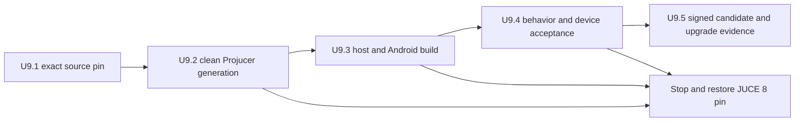

# JUCE 9 migration plan

## Purpose and confirmed decisions

Upgrade the workspace-local JUCE submodule from `8.0.13` at commit `7c9d3783b127263d72bb65fe0a7e2dc8a02a7ac2` to the newest stable upstream release available during this planning pass: `9.0.1` at commit `e18f7f506c0b96f2c738a0bcd7fe6467a5005ad8`.

The migration is limited to JUCE and the reproducibility, build, validation, and release evidence that the dependency change directly affects. It does **not** include the later task concerning broader JUCE integration improvements, new framework features, or discretionary product-code rewrites.

Accepted compatibility policy:

- Preserve Android minimum, target, and compile SDK `34`, the `arm64-v8a` ABI, JDK `17`, C++23, and the current permission-deny policy from [`release/release.properties`](../release/release.properties:8).
- Record Android API 35 adoption as a separate future platform-compatibility decision. Do not bundle Android 15 behavior changes into this dependency migration.
- Retain the generated-Android route: [`Shuba.jucer`](../Shuba.jucer:3) remains authoritative and [`Builds/Android`](../Builds/Android) plus [`JuceLibraryCode`](../JuceLibraryCode) remain disposable outputs.
- Pin the exact JUCE 9.0.1 tag and commit rather than following an upstream branch.

## Recommendation

Adopt JUCE `9.0.1`, rather than `9.0.0` or a continuing `8.x` pin. It is the current stable patch release and includes the complete JUCE 9 generator/runtime behavior plus its first patch fixes. The project has no identified direct use of the JUCE 9 removed or signature-changed public APIs: no `Drawable` ownership/inheritance use, legacy SVG parser call, custom `Typeface`, OpenGL, WebView, Javascript, plugin, or audio API use.

This is still a **high-observation** migration because the application relies on JUCE as all of the following:

- Android project generator and Gradle/NDK integration through [`Shuba.jucer`](../Shuba.jucer:273).
- Android Storage Access Framework document selection and streaming through [`JuceAndroidPhotoSelectionService::request_photo_selection()`](../Source/Platform/JuceAndroidServices.cpp:444) and [`JuceAndroidDocumentExportService::copy_file_to_destination()`](../Source/Platform/JuceAndroidServices.cpp:586).
- Raw JNI helper ownership and Android previous-exit recovery through [`JuceAndroidPreviousExitService::query_previous_exit()`](../Source/Platform/JuceAndroidPreviousExit.cpp:527).
- All UI drawing, font selection, Russian rendering, input, touch/scroll behavior, safe-area layout, and message-thread callback delivery through [`AppShellComponent::resized()`](../Source/UI/AppShell.cpp:500), [`style_text_editor()`](../Source/UI/View/Primitives/Palette.cpp:54), and [`fullscreen_safe_content_bounds()`](../Source/UI/View/SafeArea.hpp:46).
- ZIP, JPEG, hashing, generated localization resources, and native C/C++ build composition through [`JuceZipArchiveService::build_zip_archive()`](../Source/Platform/JuceZipArchive.cpp:95), [`JuceJpegExportService::write_jpeg()`](../Source/Platform/JuceJpegExport.cpp:120), [`JuceMd5SourceByteFingerprintService::fingerprint_source_bytes()`](../Source/Platform/JuceHashing.cpp:24), and [`CMakeLists.txt`](../CMakeLists.txt:219).

## Research findings and migration risks

| Upstream change or generated-output delta | Project exposure | Required response and proof |
| --- | --- | --- |
| JUCE 9 changes SVG parsing, moves `Drawable` out of `juce_gui_basics`, and changes related `DrawableShape` APIs | No direct source use found; the project links `juce_graphics` and `juce_gui_basics` through [`shuba_juce_platform`](../CMakeLists.txt:245). | Compile host and Android targets after regeneration. Treat a module/source inventory change as a generator update to review, not an automatic failure to suppress. |
| JUCE 9 text stack, variable fonts, font fallback, and default metrics may change visual layout | Every screen uses `FontOptions`, `drawFittedText`, labels, text editors, and Russian strings, including [`TextRowComponent::paint()`](../Source/UI/View/Primitives/Rows.cpp:18) and [`draw_preview_image_slot()`](../Source/UI/View/Primitives/Previews.cpp:221). | Keep existing font construction unless device evidence identifies clipping, baseline drift, or unreadable fallback. Manually validate English and Russian text, controls, forms, filters, dialogs, photo captions, and text input. Capture safe screenshots for the exact APK. |
| JUCE 9 compiles bundled zlib, JPEG, PNG, and FLAC as C rather than C++ | JUCE ZIP and JPEG are used, but no direct external zlib/jpeg/png/flac integration is present. The host project already enables C in [`project()`](../CMakeLists.txt:3). | Inspect generated native source and link diffs; do not disable bundled libraries preemptively. Build host and Android targets, then exercise JPEG export and ZIP create/reopen/extract. Stop on duplicate symbols or any new native-library collision. |
| JUCE 9 Android exporter defaults change to API 35, NDK 28.1.13356709, Gradle 8.13, and AGP 8.13.2 | Project must keep API 34 and NDK 29.0.14206865. The current NDK override is source-owned in [`Shuba.jucer`](../Shuba.jucer:285). | Preserve explicit API 34 authority and NDK override. Make Gradle and AGP versions explicit in [`Shuba.jucer`](../Shuba.jucer:274) to match the release contract instead of relying on upstream defaults. Rebuild generated-validation expectations from the final target output. |
| Generated identity changes from JUCE 8 `0x8000d` to JUCE 9 `0x90001`; generated files/source inventory can change | The release validator currently locks JUCE 8 identity, file inventory, resource output, and the old commit in [`shuba_generated_check_native_cmake()`](../tools/release/lib/generated-android-validation.fish:349) and [`shuba_validate_generated_android()`](../tools/release/lib/generated-android-validation.fish:479). | Update only target-specific facts after clean JUCE 9 regeneration; retain the semantic checks for project identity, API 34, ABI, C++23, no GNU extensions, no forbidden permissions, source inventory, libjxl link order, and resources. Extend the mutation corpus whenever a changed assertion represents a new failure mode. |
| JUCE licensing moves to the JUCE 9 license/EULA or AGPLv3 route | Public distribution policy has not been finalized in [`docs/release.md`](../docs/release.md:100). | Before building a distributable candidate, record the applicable license route and verify required notices/corresponding-source obligations. This plan does not give legal advice or choose a license route. |

## Minimal sequential migration blocks

### U9.1 — Pin JUCE 9 and make the generator authority explicit

**Owner:** dependency/release tooling.

**Changes:**

1. Move the [`third_party/JUCE`](../.gitmodules:1) gitlink to the exact `9.0.1` commit and confirm the tag resolves to that commit.
2. Replace the JUCE 8 version and commit literals in [`shuba_projucer_validate_source()`](../tools/release/build-projucer.fish:15), [`shuba_projucer_validate_outputs()`](../tools/release/build-projucer.fish:32), and [`shuba_projucer_write_descriptor()`](../tools/release/build-projucer.fish:58).
3. Promote the release contract to schema `3` and replace its single Android command-line-tools version with the ordered bounded allowlist `android.command_line_tools_versions=20.0,12.0`. The order is the deterministic selection precedence: prefer `20.0`, then `12.0`. Update [`shuba_contract_validate()`](../tools/release/lib/release-contract.fish:45), the Android-tool resolver, release/upgrade provenance, and their focused mutation tests in lockstep. The selected revision remains an explicit tool-descriptor and provenance fact; do not claim output-byte equivalence between the two allowed inspector/SDK-management revisions.
4. Make [`shuba_resolve_android_command_line_tools_root()`](../tools/release/lib/android-toolchain.fish:46) accept only a release-contract allowlisted revision. For each allowed revision in contract order, prefer an installed same-named directory whose [`source.properties`](../tools/release/lib/android-toolchain.fish:59) reports that exact revision; otherwise accept the `latest` alias only if its metadata reports that allowed revision. Reject unlisted, malformed, duplicate, symbolic-link, or non-executable candidates. Expose and validate the selected sibling `sdkmanager` and `apkanalyzer`; the release rehearsal must invoke this selected `sdkmanager`, not an independent `latest` path.
5. Add explicit JUCE 9-compatible Gradle and AGP exporter properties to [`Shuba.jucer`](../Shuba.jucer:274), matching [`release/release.properties`](../release/release.properties:15). Preserve the authoritative API 34, C++23, GNU-extension-off, ABI, resource, permission, static-libjxl, and NDK override settings.
6. Amend durable documentation only where it names the supported framework version, release license location, API 35 deferral, or bounded command-line-tools policy. Do not alter product behavior or release identity in this block.

**Entry gate:** the working tree has recursive submodules available, no generated outputs are treated as authority, and an Android SDK contains one allowed command-line-tools revision with valid executable metadata.

**Acceptance:** focused release-contract/toolchain tests prove `20.0` selection precedence, `12.0` fallback, metadata-checked `latest` fallback, and rejection of unlisted/malformed/duplicate tool candidates. A from-absent Projucer build reports `9.0.1`, its fingerprint records the new commit and source state, and repeated `--check` validation reuses the exact cache rather than accepting a stale JUCE 8 artifact. Release and upgrade provenance identify both the allowlist and the selected tool revision/path/hash.

**Rollback/stop:** restore only the JUCE gitlink, matching release-tool literals, and prior schema-2 command-line-tools pin to `8.0.13`; remove ignored Projucer outputs and rerun the old validation. Stop for a tag/commit mismatch, dirty submodule, ambiguous tool selection, a tool capability failure, or a JUCE 9 license decision that blocks intended distribution.

### U9.2 — Regenerate once from authority and update the generated contract precisely

**Owner:** generated Android validation.

**Changes:**

1. Remove only ignored [`Builds/Android`](../Builds/Android) and [`JuceLibraryCode`](../JuceLibraryCode) output using the ownership rules in [`generate-android.fish`](../tools/release/generate-android.fish:41).
2. Generate with the JUCE 9 Projucer twice from clean output and compare the output structure and tracked-authority hash after each run.
3. Update [`generated-android-validation.fish`](../tools/release/lib/generated-android-validation.fish:96) and [`test-generated-android.fish`](../tools/release/tests/test-generated-android.fish:46) in lockstep for intentional JUCE 9 facts: generator version, exact generated-file inventory, generated compilation units, and generator-controlled text that changed upstream.
4. Preserve or strengthen checks for non-negotiable Shuba behavior: API 34, min/target/compile alignment, NDK 29.0.14206865, Gradle/AGP contract values, C++23, extensions off, arm64-v8a only, static libjxl link order, product identity, generated Russian BinaryData, app icon resources, and zero requested permissions.

**Entry gate:** U9.1 pin and Projucer fingerprint are valid. The tracked [`Shuba.jucer`](../Shuba.jucer:3) has the reviewed JUCE 9 canonical Android-exporter representation: the `gradleVersion` and `androidPluginVersion` attributes retain their release-contract values, and the exporter attribute/value projection is unchanged from U9.1 authority apart from that reviewed canonical placement.

**Acceptance:** First, cleanly resave the reviewed canonical [`Shuba.jucer`](../Shuba.jucer:3) and prove its byte hash remains unchanged. Then [`generate-android.fish`](../tools/release/generate-android.fish:11), [`check-generated-android.fish`](../tools/release/check-generated-android.fish:3), and the generated mutation corpus all pass from two independent clean generations with identical authority hash, generated-file inventory, and generated-output content digest. Generated differences are documented as upstream JUCE 9 output changes, never manually patched.

**Rollback/stop:** restore the U9.1 pin before modifying runtime code if regeneration is non-deterministic, the generator rewrites the reviewed canonical [`Shuba.jucer`](../Shuba.jucer:3), required API 34/NDK/permission behavior cannot be expressed by authority, or a proposed test update weakens a security/reproducibility invariant.

### U9.3 — Compile, link, and analyze the target dependency graph

**Owner:** host build plus Android build integration.

**Changes:**

1. Reconfigure fresh host trees; correct only compile/link incompatibilities caused by JUCE 9. Keep core/domain/persistence logic independent of JUCE as required by [`docs/architecture.md`](../docs/architecture.md:35).
2. Inspect all changed generated C/C++ compilation units and native libraries before accepting the new C-language bundled-library behavior. Do not add external zlib/jpeg/png/flac or change JUCE include flags unless a concrete duplicate-symbol diagnosis requires it.
3. Build the generated Android Debug variant through its generated wrapper after the generated-contract gate succeeds. Preserve `arm64-v8a`, API 34, C++23, and NDK 29.0.14206865.
4. Address static-analysis findings narrowly; do not blindly copy forward third-party suppression line numbers from [`CMakeLists.txt`](../CMakeLists.txt:56).

**Entry gate:** two clean U9.2 generations and generated mutation tests pass.

**Acceptance:** the CI-equivalent host test/localization lane, ASAN lane, static-analysis lane, hermetic release-tool tests, generated release-tool tests, and an Android Debug build pass. The linker report has no duplicate bundled-library symbols and the output APK retains only the contract-approved ABI/library/component/permission shape.

**Rollback/stop:** revert to U9.1 only if a build problem cannot be fixed without changing the product boundary, weakening a verification gate, adding an unjustified external library, or abandoning generated JUCE Android ownership.

### U9.4 — Verify affected runtime behavior on the supported Android 14 device

**Owner:** Android platform/UI acceptance.

**Status (2026-08-17):** **Accepted.** Manual testing completed without problems on the supported Jelly Max Android 14 / API 34 / `arm64-v8a` device, using the exact generated Debug APK with SHA-256 `2aaff9afbc4c3a155bf859b44baf073758af1ceb87f5543581d9b5f33589a13f`. No focused compatibility correction was required.

**Changes:** no feature work by default. Make a focused compatibility correction only when a reproducible JUCE 9 regression is observed and covered by a focused test where possible.

**Device matrix for the exact JUCE 9 Debug build:**

1. Launch/cold-launch and verify startup recovery and prior-exit query behavior, including the raw JNI path in [`JuceAndroidPreviousExitService::query_previous_exit()`](../Source/Platform/JuceAndroidPreviousExit.cpp:527).
2. Verify English and Russian rendering at root routes, details, forms, filters, photo/backup screens, warnings, text editors, long labels, and scrollable rows. Check clipping, baseline alignment, fallback glyphs, keyboard focus, and touch/scroll activation.
3. Verify fullscreen safe-area layout in gesture and three-button navigation, then after rotation/runtime inset changes through [`fullscreen_safe_content_bounds()`](../Source/UI/View/SafeArea.hpp:46).
4. Verify the system picker with multiple photos, content-URI staging, import/decode/internal JPEG XL storage, preview/viewer behavior, and JPEG export/opening.
5. Verify document-backed normal/diagnostic backup export, archive reopen/inspection, staged import, explicit replacement, rollback safety, and force-stop/cold-launch persistence.

**Entry gate:** U9.3 is green and the candidate package remains API 34/arm64-v8a.

**Acceptance:** no crash, ANR, data loss, source-provider failure, text accessibility/regression, unexpected permission/component, or UI input starvation. Record device/API, exact APK hash, steps, expected/actual result, safe screenshots, and relevant log excerpts.

**Rollback/stop:** stop at the first reproducible regression that needs a new Android API policy, manual generated-file patch, broad Java/Kotlin addition, or unrelated UI rewrite. Classify it and return it as a separate smallest-owner task if it exceeds a focused compatibility fix.

### U9.5 — Produce candidate-specific release and upgrade evidence

**Owner:** release boundary.

**Changes:** execute the existing immutable-state, signing, artifact-verification, and adjacent-code upgrade workflow; do not change release identity merely to hide a dependency failure. When a prior accepted packet already occupies `dist/release`, validate it against its own retained provenance, checksum, verification evidence, signer, and structural identity before atomic successor replacement. Do not reinterpret the historical packet under the successor contract, and retain all successor staging and post-publication verification as successor-contract-driven checks.

**Entry gate:** U9.1 through U9.4 are accepted, the chosen JUCE 9 license route is recorded for the intended distribution context, and the private signing boundary is available.

**Acceptance:**

1. Build the final signed candidate only through [`build-android-release.fish`](../tools/release/build-android-release.fish:12).
2. Confirm the final four-file packet, contract identity, signer, APK contents, and provenance against the exact JUCE 9 source state. A prior packet may be replaced only after a dedicated provenance-bound validator proves its exact historical four-file inventory, checksum/provenance byte binding, retained pre/post evidence, signer/application/ABI continuity, and strictly lower version code; malformed, unverifiable, probe-contaminated, or successor-reinterpreted prior evidence is a stop condition.
3. Install the candidate over the previously accepted same-key baseline where available; verify catalog, media, and recovery preservation.
4. Build the isolated adjacent-code probe using [`build-android-upgrade-probe.fish`](../tools/release/build-android-upgrade-probe.fish:55), install it over the final candidate, and recheck preservation plus backup restore. Keep it below [`dist/non-final`](../dist/non-final) only.
5. Run the protected rehearsal workflow path in [`android-release-rehearsal.yml`](../.github/workflows/android-release-rehearsal.yml:16) after local evidence is satisfactory.

**Rollback/stop:** before final publication, restore the source pin and rebuild from clean output if any candidate gate fails. Never manually delete, move, rename, or reinterpret a prior accepted packet to bypass a failed successor gate. After a verified final artifact is accepted, never replace its bytes or reinterpret its evidence; a subsequent correction requires a new source state and release candidate under the existing release procedure.

## Required validation order

1. Pin check and clean Projucer build.
2. Two clean regenerations plus generated validator/mutation corpus.
3. Host configuration/build, localization validation, registered tests, ASAN, and static analysis through [`CMakePresets.json`](../CMakePresets.json:8).
4. Hermetic and generated release-tool suites through [`run-release-tool-tests.fish`](../tools/ci/run-release-tool-tests.fish:8).
5. Generated Android Debug build and APK structural verification.
6. Targeted Android 14 device matrix.
7. Signed candidate, final artifact packet verification, same-key upgrade, backup restore, and protected rehearsal.

The migration succeeds only when all earlier layers are green. A device pass never compensates for a failed reproducibility/build/verification gate, and a host pass never substitutes for Android provider, text, safe-area, or installation evidence.

## Explicitly deferred to the later task

- Replacing existing screens/widgets with new JUCE 9 mechanisms.
- Taking advantage of JUCE 9 SVG, variable-font, renderer, OpenGL, WebView, Javascript, audio, plugin, or desktop features.
- Refactoring platform services that compile and behave correctly after the migration.
- Android API 35 adoption, min-SDK expansion, extra ABI support, or permission/product-boundary expansion.

## Approved post-migration integration improvements

The following blocks are accepted independently of the U9.1–U9.5 dependency migration. They must start only from an accepted JUCE 9 candidate/source state, remain within the stated owner, and not change generated Android files directly.

### JI.1 — Canonical Android image-picker MIME contract

**Owner:** [`Source/Platform`](../Source/Platform) with the picker call sites in [`Source/UI/AppShellPhotoCoordinator.cpp`](../Source/UI/AppShellPhotoCoordinator.cpp:146).

**Problem and evidence:** [`JuceAndroidPhotoSelectionService::request_photo_selection()`](../Source/Platform/JuceAndroidServices.cpp:444) currently passes wildcard filters derived by [`file_patterns_for_mime_types()`](../Source/Platform/PlatformServices.cpp:456) into JUCE’s native Android [`juce::FileChooser::launchAsync()`](../third_party/JUCE/modules/juce_gui_basics/filebrowser/juce_FileChooser.h:204). JUCE provides `FileChooser::registerCustomMimeTypeForFileExtension()` for Android wildcard-to-MIME resolution, but the project does not register its selected image mappings. The request call sites currently list JPEG, PNG, WebP, HEIC, and HEIF separately, while the shared mapper also describes GIF and BMP, creating a possible policy/filter/provider mismatch.

**Smallest accepted outcome:**

1. Define one source-owned canonical supported source-image type table containing JPEG with `.jpg` and `.jpeg`, PNG with `.png`, WebP with `.webp`, HEIC with `.heic`, HEIF with `.heif`, GIF with `.gif`, and BMP with `.bmp`.
2. Expose a platform helper that derives the photo-picker request MIME types and wildcard patterns from that table, and register the equivalent mappings through JUCE exactly once before the first native Android photo-picker request. The helper must be a safe no-op on non-Android host builds.
3. Replace the duplicated literal MIME vectors in [`AppShellPhotoCoordinator::request_add_photos()`](../Source/UI/AppShellPhotoCoordinator.cpp:146) and [`AppShellPhotoCoordinator::request_add_pending_photos()`](../Source/UI/AppShellPhotoCoordinator.cpp:225) with the canonical request source.
4. Retain the current [`juce::FileChooser`](../third_party/JUCE/modules/juce_gui_basics/filebrowser/juce_FileChooser.h:124) route, asynchronous callback lifetime, picker-grant-only permission policy, shallow descriptor handoff, and worker-side staging. Do not add a Java/Kotlin Photo Picker bridge, broad-media permissions, new Android API policy, or persistence changes.

**Focused proof:** extend [`tests/B10PlatformServicesTests.cpp`](../tests/B10PlatformServicesTests.cpp:160) to prove a unique deterministic table, both JPEG extensions, all seven MIME identities, their wildcard output, and that unsupported MIME values retain the existing safe fallback behavior. Extend the applicable photo-workflow tests to assert that both entry points submit the canonical request. Run the affected host tests plus the normal platform/UI test lane.

**Android acceptance:** using the exact generated JUCE 9 Debug APK on the supported Android 14 arm64 device, open the multi-select picker from both direct-import and pending-form paths; select and stage representative JPEG, PNG, WebP, HEIC or HEIF, GIF, and BMP inputs where the chosen provider exposes them; verify successful import or a precise existing decoder/provider diagnostic, no picker crash or stuck busy state, no unexpected permissions, and correct cancellation/retry behavior. Record the provider, device/API, exact APK hash, visible picker filtering, URI/staging result, and any provider-specific format refusal. A provider that does not expose a type is evidence to classify, not grounds to add a bridge in this block.

**Preliminary device evidence (2026-08-17):** on the supported Android 14 / arm64 device, the direct-import and pending-form picker routes opened and completed without an observed problem. This is a smoke result only: the exact APK hash, provider, format exposure and staging outcomes, cancellation/retry behavior, and permission-shape evidence remain required for formal acceptance.

**Stop/rollback:** stop and return to architecture if JUCE registration requires generated-file modification, introduces a permission/component change, prevents an already-supported type from being selected, causes a reproducible provider failure after the existing document path is verified, or requires Java/Kotlin. Revert only the canonical-table/helper and call-site/test changes; do not alter catalog data or user media.

### JI.2 — Generalize shell long-operation orchestration off the JUCE message thread

**Owner:** [`Source/UI`](../Source/UI), centered on [`AppShellOperationRunner`](../Source/UI/AppShellOperationRunner.hpp:83), [`AppShellComponent`](../Source/UI/AppShell.hpp:68), and the UI session request/result types.

**Status (2026-08-17):** **Accepted.** The single owned shell-operation worker now runs all specified photo, JPEG, backup-export, backup-import-staging, and confirmed-replacement work using worker-local platform services, immutable snapshots, cancellation propagation, coalesced progress, callback-lifetime guards, and generation-validated message-thread result application. The required worker-local Android SAF destination-transfer probe passed through Files by Google / Downloads. Final Android matrix acceptance passed on the supported Jelly Max Android 14 / API 34 / `arm64-v8a` device using the generated Debug APK with SHA-256 `7eeaa7aceee7978d6f78b478f581e066d79287158b24586a7468d7b1fa63907c`: JPEG, normal backup, diagnostic archive, import/staging, confirmed replacement, and available cancellation behavior were accepted without an ANR, stale result, data loss, or permission/component change.

**Problem and evidence:** the project already moves photo selection staging/import work through an owned worker, generation guard, progress coalescer, and lifetime-safe message-thread result delivery in [`AppShellPhotoOperationRunner::worker_loop()`](../Source/UI/AppShellPhotoOperationRunner.cpp:245). In contrast, JUCE picker completion callbacks synchronously execute JPEG decode/encode/document copy in [`AppShellPhotoCoordinator::request_export_photo()`](../Source/UI/AppShellPhotoCoordinator.cpp:340), normal and diagnostic archive creation/copy in [`AppShellComponent::request_export_backup()`](../Source/UI/Screens/MaintenanceScreens.cpp:23) and [`AppShellComponent::request_export_diagnostic_archive()`](../Source/UI/Screens/MaintenanceScreens.cpp:73), archive staging/validation in [`AppShellComponent::request_import_backup()`](../Source/UI/Screens/MaintenanceScreens.cpp:124), and confirmed catalog replacement in [`AppShellComponent::confirm_staged_backup_import()`](../Source/UI/Screens/MaintenanceScreens.cpp:272). These are long operations on the JUCE message thread and pass [`never_cancelled`](../Source/UI/AppShell.hpp:198), conflicting with the long-work, lifetime, cancellation, and progress invariant in [`docs/architecture.md`](../docs/architecture.md:115).

**Smallest accepted outcome:**

1. Rename and generalize the photo-specific runner/state/job vocabulary into a shell-operation facility without changing the public catalog, persistence, or platform-service contracts. Retain its single owned worker, one-queued-job policy, generation guard, join-on-teardown behavior, and coalesced message-thread progress delivery.
2. Add discriminated immutable job and result variants for direct/pending photo work, JPEG export, normal backup export, diagnostic archive export, backup-import staging/validation, and explicitly confirmed replacement. Picker callbacks must capture only the selected descriptor/destination and source-owned session/request snapshot; they must never perform archive, codec, stream, staging, copy, or replacement work themselves.
3. Construct worker-local JUCE/platform service implementations required by each job, preserve one shared [`core::OperationGate`](../Source/Core/OperationGate.hpp:11), and route the runner cancellation token into every cancellable use case. Apply result/feedback/session/route state exclusively on the JUCE message thread after validating the operation generation.
4. Expand the persistent progress component from photo-only presentation to operation-neutral localized headings and summaries. Preserve in-place progress updates; do not rebuild screen content for each progress event. While an operation is active, keep existing mutation/navigation blocking semantics and make cancellation available only when the reported phase is cancellable.
5. Preserve explicit degraded-import acknowledgement and replacement confirmation. A replacement job starts only after those UI confirmations; its worker result must retain the existing fatal-recovery behavior and never silently normalize failed catalog state.
6. Do not introduce Java/Kotlin, new permissions/components, generated Android-file edits, additional worker pools, persisted queues, or changes to archive/media/schema semantics.

**Focused proof:** extend the current runner/lifetime coverage in [`tests/B29PhotoCoordinatorLifetimeTests.cpp`](../tests/B29PhotoCoordinatorLifetimeTests.cpp:316) or replace it with focused operation-runner tests that prove accepted, busy, cancelled, completed, and failed outcomes for every variant; immutable request/session snapshot behavior; one-at-a-time operation gating; cancellation propagation; progress coalescing; stale-generation suppression; and no callback after shell teardown. Retain focused use-case coverage in [`tests/B14PhotoExportTests.cpp`](../tests/B14PhotoExportTests.cpp:1), [`tests/B15BackupArchiveTests.cpp`](../tests/B15BackupArchiveTests.cpp:1), [`tests/B16CatalogReplacementTests.cpp`](../tests/B16CatalogReplacementTests.cpp:1), and [`tests/B20BackupRecoverySessionTests.cpp`](../tests/B20BackupRecoverySessionTests.cpp:160). Run the affected suite, then full host, ASAN, static-analysis, and generated Android validation lanes.

**Android acceptance:** with the exact JUCE 9 Debug APK on the supported Android 14 arm64 device, export and externally open a normal backup and diagnostic archive; import, stage, acknowledge where required, and explicitly replace from a retained backup; export and externally open JPEG; cancel each exposed cancellable copy/codec/archive phase where practical; rotate, navigate within allowed bounds, and verify responsive touch/scroll/feedback while work continues. Record device/API, exact APK hash, provider, operation phase, cancellation expectation/result, resulting catalog/backup integrity, and safe logs/screenshots. There must be no ANR, input starvation, stale result application, data loss, or unexpected permission/component.

**Stop/rollback:** stop and return to architecture if any JUCE/Android stream, codec, picker, or replacement dependency proves unsafe off the message thread; result application requires reading mutable editor/component state; a new lock or queue is needed to preserve operation ordering; cancellation cannot retain current rollback/cleanup guarantees; or a generated/Java/permission change is proposed. Revert the runner generalization atomically to the existing photo worker and synchronous routes only before release acceptance; do not roll back catalog data, created backups, or user-visible recovered state.

### JI.3 — Shaped text measurement at manual presentation boundaries

**Owner:** [`Source/UI/View`](../Source/UI/View), beginning with [`draw_preview_badge()`](../Source/UI/View/Primitives/Previews.cpp:83) and a small typography helper colocated with [`Palette.cpp`](../Source/UI/View/Primitives/Palette.cpp:1).

**Problem and evidence:** the application already constructs portable [`juce::FontOptions`](../Source/UI/View/Primitives/Palette.cpp:54), which preserve JUCE text fallback and metric behavior. However, [`draw_preview_badge()`](../Source/UI/View/Primitives/Previews.cpp:83) estimates its localized badge width with `text.length() * 7`. Character count is not shaped glyph width and is unreliable for Russian text, fallback glyphs, variable fonts, kerning, or scaled rendering. JUCE recommends shaped text measurement rather than legacy naive font-width assumptions in [`BREAKING_CHANGES.md`](../third_party/JUCE/BREAKING_CHANGES.md:801), and [`juce::TextLayout`](../third_party/JUCE/modules/juce_graphics/fonts/juce_FontOptions.h:47) provides the current measurement path.

**Smallest accepted outcome:**

1. Add a narrow UI presentation helper that constructs the already-used `FontOptions` and measures a `juce::String` through shaped JUCE text layout. Preserve portable metrics and fallback; do not select, embed, or depend on a custom typeface.
2. Replace the preview-badge character-width heuristic with the shaped width plus existing padding/minimum/available-width bounds. Preserve the current font scale, visual colors, badge placement, and fitted rendering behavior.
3. Audit only manual text-geometry calculations in custom-painted UI primitives. Convert another site only when it has the same character-count/constant-width defect and can be covered by a focused test. Do not replace existing `Label`, `TextEditor`, or ordinary [`drawFittedText`](../Source/UI/View/Primitives/Previews.cpp:100) calls wholesale with `TextLayout`, retranslate messages, force variable-font settings, or redesign screens.

**Focused proof:** extend [`tests/C30LocalizationPresentationLayoutTests.cpp`](../tests/C30LocalizationPresentationLayoutTests.cpp:12) with English and Russian badge/long-label cases that prove shaped width is positive, accounts for configured padding/clamping, and produces a badge inside its container without relying on byte/character count. Add a test for every additional audited manual-geometry site. Run localization validation and the affected UI/layout tests, then normal host and static-analysis gates.

**Android acceptance:** on the exact JUCE 9 Debug APK and supported Android 14 arm64 device, inspect English and Russian routes containing preview state badges, long photo captions, warnings, buttons, labels, text fields, filters, dialogs, and safe-area transitions. Verify no tofu/missing glyphs, unreadable scale, clipping, overlap, baseline regression, or new focus/touch issue. Record device/API, exact APK hash, font/rendering observations, and safe screenshots.

**Stop/rollback:** stop if the measured layout causes a regression that cannot be corrected within the existing typography scale/bounds, requires choosing a custom font, changes localization source text, or broadens into a renderer redesign. Revert only the helper and individual geometry substitutions; retain the existing font and localization contracts.

### JI.4 — Coalesce asynchronous preview refreshes through the existing JUCE timer

**Owner:** [`Source/UI`](../Source/UI), limited to [`AppShellPreviewScheduler`](../Source/UI/AppShellPreviewScheduler.hpp:20), [`AppShellComponent::schedule_content_refresh()`](../Source/UI/AppShell.cpp:846), and their focused UI tests.

**Problem and evidence:** each background preview/display completion currently calls [`AppShellPreviewScheduler::apply_preview_result()`](../Source/UI/AppShellPreviewScheduler.cpp:521) or [`AppShellPreviewScheduler::apply_display_result()`](../Source/UI/AppShellPreviewScheduler.cpp:540), which immediately invokes the `refresh_content` callback installed in [`AppShellComponent::AppShellComponent()`](../Source/UI/AppShell.cpp:228). A content refresh clears and recreates every visible row/component through [`AppShellContentComponent::clear_rows()`](../Source/UI/View/AppShellContentComponent.cpp:18). Multiple lazy-preview completions can therefore create repeated complete UI reconstruction on the JUCE message thread. The shell already provides an established JUCE timer coalescer in [`AppShellComponent::schedule_content_refresh()`](../Source/UI/AppShell.cpp:846), currently used for typed search updates.

**Smallest accepted outcome:**

1. Route only asynchronous preview and photo-display completion refreshes through the existing timer-based content-refresh scheduler. Multiple completions during the debounce window must yield one eventual content rebuild using the current cache/display state.
2. Preserve direct `refresh_all()` and direct `refresh_content()` paths for user-driven route, form, confirmation, and feedback state changes. Do not change preview decode priority, queue policy, cache settings, image content, worker lifetime/generation checks, or result application semantics.
3. Make the scheduling boundary observable in focused tests without exposing component internals as production API. Preserve the existing timer stop/destructor behavior so no delayed callback acts after shell destruction.
4. Do not introduce `AsyncUpdater`, a second queue/worker, list virtualization, persistent screen-component architecture, preview-artifact files, or an arbitrary delay increase beyond the existing bounded timer policy.

**Focused proof:** add or extend UI/scheduler tests to prove that a burst of preview/display completions requests one coalesced rebuild; cached preview state is rendered after delivery; direct route refresh remains immediate; stale generation/failure behavior is unchanged; and no scheduled refresh survives shell teardown. Retain [`tests/B22ImagePreviewCacheTests.cpp`](../tests/B22ImagePreviewCacheTests.cpp:338) cache coverage and [`tests/B29PhotoCoordinatorLifetimeTests.cpp`](../tests/B29PhotoCoordinatorLifetimeTests.cpp:316) async-lifetime coverage. Run the affected tests, then normal host and ASAN lanes.

**Android acceptance:** on the exact JUCE 9 Debug APK and supported Android 14 arm64 device, use long item/storage result lists and multi-photo forms; scroll while previews load, rapidly change selection, rotate, and change routes. Verify responsive touch/scroll, eventual correct previews/display image, no stale image application, no repeated visible full-screen flicker beyond the existing bounded delay, no cache-memory increase, and no crash/ANR. Record device/API, APK hash, screen/action sequence, observed delay, and safe evidence.

**Stop/rollback:** stop if completion coalescing prevents a selected viewer image from appearing, changes a non-preview user action’s immediacy, requires a new persistent/virtualized UI architecture, or introduces lifecycle races. Revert only the callback routing and focused test changes, retaining cache and decoded data contracts.

### JI.5 — Android two-finger pinch zoom for the photo viewer

**Owner:** [`Source/UI/View/Primitives`](../Source/UI/View/Primitives), limited to [`PhotoViewerImageComponent`](../Source/UI/View/Primitives/Previews.hpp:112), a local gesture-state helper, and focused viewer tests.

**Supported-device correction decision (2026-08-21):** the first generated Debug APK implementation, SHA-256 `3152261162889b63d600ce372e90cdd038654b28fb731dead37f847f573afdd0`, exposed a reproducible scroll regression on the supported Android device: after pinch zoom, a one-finger drag beginning over the viewer caption/metadata area such as the photo index, main marker, dimensions, and byte count panned the image instead of scrolling the parent page. The approved gesture hit boundary is therefore the existing painted image slot. Pinch initiation/updates and zoomed one-finger pan belong only to that slot; caption/metadata drags remain parent-viewport scroll input. The observed APK is rejected for JI.5 acceptance and must be replaced by a newly generated Debug APK after this correction.

**Status (2026-08-21):** **Accepted.** On the supported Android 14 / API 34 / `arm64-v8a` device, the exact generated Debug APK with SHA-256 `ca50cb607b65960955c48a75a8357c464850f702b6caf448acd2fc14d3f35532` passed pinch in/out, two-finger-to-one-finger handoff, rotated image-slot pan, edge clamping, selection suppression, and caption/metadata parent-viewport scrolling while zoomed and unzoomed. No crash, ANR, stale state, or duplicate/reordered/cancelled-touch anomaly was observed.

**Problem and evidence:** [`PhotoViewerImageComponent`](../Source/UI/View/Primitives/Previews.hpp:112) currently supports horizontal swipe selection when unzoomed, one-finger panning when zoomed, and double-click/tap zoom through [`PhotoViewerImageComponent::mouseDoubleClick()`](../Source/UI/View/Primitives/Previews.cpp:652), but its state in [`PhotoViewerImageComponent::mouseDown()`](../Source/UI/View/Primitives/Previews.cpp:594) is single-pointer only. JUCE’s Android peer dispatches each active touch pointer as down/drag/up input in [`ComponentPeerView.onTouchEvent()`](../third_party/JUCE/modules/juce_gui_basics/native/java/app/com/rmsl/juce/ComponentPeerView.java:222), and identifies the touch stream via [`juce::MouseInputSource::getIndex()`](../third_party/JUCE/modules/juce_gui_basics/mouse/juce_MouseInputSource.h:110). This supports a native-C++ pinch implementation without a Java/Kotlin bridge. [`juce::Component::mouseMagnify()`](../third_party/JUCE/modules/juce_gui_basics/components/juce_Component.h:1836) remains optional desktop/trackpad infrastructure only: the Android peer currently wires pointer callbacks rather than a magnify callback.

**Smallest accepted outcome:**

1. Add a small, unit-testable gesture-state helper local to the preview primitive. It may retain only two active touch indices/positions plus pinch-start distance, midpoint, zoom, and pan anchor; it must not retain route, image, catalog, or component references.
2. Extend [`PhotoViewerImageComponent`](../Source/UI/View/Primitives/Previews.hpp:112) so a second touch source that begins inside the existing painted image slot begins pinch tracking; distance changes adjust the existing bounded zoom range of `1.0` through `4.0`, preserve the image position under the pinch midpoint where geometry permits, and reapply the existing pan clamping. Lifting either touch ends pinch tracking while preserving the resulting zoom and pan. A touch beginning in the caption/metadata region must not join or begin image manipulation.
3. While a pinch is active, suppress horizontal next/previous selection, single-finger pan interpretation, and parent viewport drag handoff. When a pinch is not active, preserve the existing one-finger unzoomed swipe and zoomed pan only for gestures beginning in the image slot; a gesture beginning over the caption/metadata region must remain available to parent viewport scrolling even while the image is zoomed. Preserve double-tap reset, quarter-turn rotation, and selected-photo reset behavior. Keep [`PhotoViewerImageComponent::refresh_viewport_drag_policy()`](../Source/UI/View/Primitives/Previews.cpp:541) correct for every hit-region and pinch transition rather than blocking parent drag solely because zoom remains above `1.0`.
4. Keep the transform component-local. Do not persist zoom/pan in [`AppShellPhotoDisplayState`](../Source/UI/AppShellState.hpp:92), alter [`AppShellContentComponent::add_photo_viewer_image()`](../Source/UI/View/AppShellContentComponent.cpp:85) ownership/rebuild semantics, change data/schema/media, or add a desktop gesture requirement.
5. Do not modify generated JUCE/Android code or add a Java/Kotlin bridge, permissions, platform API change, new worker, or additional component hierarchy.

**Focused proof:** add focused gesture-math coverage alongside [`tests/B22ImagePreviewCacheTests.cpp`](../tests/B22ImagePreviewCacheTests.cpp:1) or in a dedicated primitive test file. Prove two-touch start/update/end transitions, zoom bounds, midpoint-preserving pan calculation where unclamped, edge clamping, missing/duplicate/out-of-order touch index safety, swipe suppression during a pinch, and restoration of the current image-slot one-finger/double-tap behaviors after it ends. Add focused hit-boundary coverage proving that an image-slot start may swipe, pan, or pinch as applicable; a caption/metadata start cannot pan or join a pinch; and the viewport-ignore-drag policy remains false for caption/metadata starts even while zoomed. Run the affected UI tests, then normal host, ASAN, static-analysis, and generated Android validation lanes.

**Android acceptance:** only after the JUCE 9 candidate is accepted, use the exact generated Debug APK on the supported Android 14 arm64 device. Verify pinch in/out, handoff from two fingers to one finger, image-slot pan at each viewer rotation, image-edge clamping, caption/metadata drag scrolling while unzoomed and zoomed, no accidental previous/next selection, no parent scrolling during an active pinch, and stable route/rotation/content-rebuild recovery. Explicitly repeat the rejected-APK sequence by starting the drag over the visible photo index/main/dimensions/byte-count text and confirm that the page scrolls while the image transform remains unchanged. Capture failure evidence for any duplicate, reordered, or cancelled touches that the device can produce. Record device/API, exact APK hash, screen sequence, gesture result, safe screenshots, and relevant logs.

**Stop/rollback:** stop and return to architecture if the supported device does not deliver stable dual-touch streams, a touch stream can trigger unwanted swipe/scroll behavior, midpoint preservation cannot coexist with the existing transformed-image bounds, teardown/rebuild produces a stale pointer state, or success would require generated JUCE/Android patches. Revert only the local helper, viewer changes, and focused tests; retain the existing tap zoom, pan, rotation, and selection behavior.

### JI.7 — Route Android system Back through the existing shell policy

**Owner:** [`Source/Main.cpp`](../Source/Main.cpp:204), [`Source/UI/AppShell`](../Source/UI/AppShell.hpp:61), and [`AppShellRouteCoordinator`](../Source/UI/AppShellRouteCoordinator.hpp:10), with route-policy tests.

**Problem and evidence:** JUCE dispatches Android system Back to [`juce::JUCEApplication::backButtonPressed()`](../third_party/JUCE/modules/juce_gui_basics/native/juce_Windowing_android.cpp:1833). [`ShubaApplication`](../Source/Main.cpp:204) does not currently override it, so JUCE treats the event as unhandled and finishes the Android activity. That bypasses Shuba’s visible Back control in [`AppShellChromeComponent::layout_shell()`](../Source/UI/View/AppShellChromeComponent.cpp:303) and cleanup centralized in [`AppShellRouteCoordinator::select_root()`](../Source/UI/AppShellRouteCoordinator.cpp:22), including photo-viewer display invalidation, pending-form photo cleanup, and backup-import state cleanup.

**Smallest accepted outcome:**

1. Introduce an application-level back delegate owned by [`MainWindow`](../Source/Main.cpp:112). Override [`ShubaApplication::backButtonPressed()`](../third_party/JUCE/modules/juce_gui_basics/native/juce_Windowing_android.cpp:1836) only to forward to that delegate and return whether it consumed the event. Do not add Java/Kotlin, manifest, permission, or generated Android changes.
2. Add one pure, unit-tested route decision helper at the shell/coordinator boundary. It must not maintain browser-style history and must return unhandled when a photo/backup operation is active, when the shell is in a fatal recovery state, or when the destination is a root route.
3. For safe in-app unwinding, match existing visible controls and reuse their cleanup: close a catalog filter panel by discarding only its draft; cancel a pending photo deletion confirmation; return a photo viewer to its selected item/storage detail; return item detail to Catalog and storage detail to Storages; return item/storage forms to their existing `form_return_destination` while running the current pending-photo cleanup; and return BackupRecovery to More only if the session is non-fatal and no staged import/replacement confirmation is outstanding. Do not auto-save, introduce a new discard confirmation, or bypass an existing destructive confirmation.
4. Apply at most one refresh after a consumed event. Keep the default Android activity-finish behavior for unhandled root/fatal/active-operation Back events, and keep cancellation solely in the existing progress control.
5. Keep Back policy independent of underlying catalog/persistence/platform contracts and do not change existing route, form, media, backup, or recovery data semantics.

**Focused proof:** add a pure route-policy test file or extend focused UI-state tests to cover every destination, active-operation guard, fatal-session guard, filter panel, delete confirmation, staged-import confirmation, form return destination, selected viewer owner, and root fallback. Add an application-delegate test using a small fake/abstract handler rather than requiring a device for policy coverage. Run affected UI tests, then normal host, ASAN, static-analysis, and generated Android validation lanes.

**Android acceptance:** on the exact generated JUCE 9 Debug APK and supported Android 14 arm64 device, verify system Back under gesture and three-button navigation with the keyboard visible, catalog filters visible, deletion confirmation visible, item/storage detail, photo viewer, item/storage forms containing staged photos, BackupRecovery with and without a staged import, an active operation, a root route, and fatal recovery. Confirm each consumed transition matches the visible control, root/fatal paths finish as Android normally requires, no staged media/catalog state is lost outside the current Cancel semantics, and no operation is cancelled/hidden. Record device/API, APK hash, starting state, Back outcome, cleanup result, and safe evidence.

**Stop/rollback:** stop if form-return behavior is ambiguous, system Back can dismiss an irreversible confirmation, an active operation becomes cancelable/hidden by Back, a root/fatal path cannot retain default Android behavior, or supported-device testing conflicts with Android keyboard/predictive Back dispatch. Revert only the delegate, route policy, and focused tests; retain current activity-finish behavior.

### JI.7A — Contextual Android Back unwinding and chrome-space correction

**Status (2026-08-23):** **Host implementation and focused validation complete; Android acceptance pending.** The source-owned bounded contextual chain, system-Back policy, and chrome-space correction compile and passed the complete host test suite (211 tests), including the focused Back/chrome coverage, plus the hermetic release-tool suite. A new generated Android Debug APK and the required supported-device matrix remain mandatory before this block can be accepted.

**Owner:** [`Source/UI/AppShell`](../Source/UI/AppShell.hpp:68), [`AppShellRouteCoordinator`](../Source/UI/AppShellRouteCoordinator.hpp:11), [`AppShellRouteState`](../Source/UI/AppShellState.hpp:42), and [`AppShellChromeComponent`](../Source/UI/View/AppShellChromeComponent.hpp:15), with focused route-policy and chrome-layout tests.

**Problem and correction decision:** JI.7 establishes Android system Back delivery and safe cleanup, but its fixed `ItemDetail` to Catalog and `StorageDetail` to Storages mapping does not preserve the actual route that opened a detail. On the supported interaction model this produces incorrect unwinding: a storage opened from Catalog returns to Storages; a child storage returns to Storages instead of its displayed parent; and an item opened inside a storage returns to Catalog instead of that storage. The visible top Back button also duplicates Android system navigation while reserving a 44-pixel row on detail, viewer, form, and recovery screens. The accepted correction is a bounded, back-only contextual route chain that preserves the full in-app detail path until a root is reached, is cleared by explicit bottom-tab selection, and has no forward-navigation or persistence semantics.

**Smallest accepted outcome:**

1. Add an ephemeral route-location value that can represent Catalog, Storages, Add, More, ItemDetail with its selected item identifier, or StorageDetail with its selected storage identifier. Extend [`AppShellRouteState`](../Source/UI/AppShellState.hpp:42) with a bounded contextual return chain using a named maximum depth of `64`. This is source-owned UI navigation context, not browser-style forward history: it must not retain components, sessions, catalog records, mutable form data, or platform objects; it must not be persisted. When the bound is reached, preserve the first root anchor and the most recent locations so repeated Back still terminates at a root.
2. Capture the current root/detail location centrally before [`AppShellRouteCoordinator::open_item_detail()`](../Source/UI/AppShellRouteCoordinator.cpp:139) or [`AppShellRouteCoordinator::open_storage_detail()`](../Source/UI/AppShellRouteCoordinator.cpp:147) changes the destination. This must cover Catalog and Storages results, storage parent/child traversal, storage-to-item selection, item-to-assigned-storage selection, and mixed repeated paths without adding route-policy literals to individual cards.
3. On safe detail Back, restore the exact previous location and selected identifier atomically, pop only that edge, and reuse [`AppShellRouteCoordinator::select_root()`](../Source/UI/AppShellRouteCoordinator.cpp:85) cleanup without an intermediate refresh. PhotoViewer remains a leaf that returns to its owning ItemDetail or StorageDetail while preserving that detail's earlier chain. Item/storage forms retain their existing `form_return_destination`, selected identifiers, pending-photo cleanup, and Cancel semantics. BackupRecovery retains its guarded return to More.
4. An explicit bottom-tab selection must clear the contextual chain before selecting its destination. Android Back on Storages, Add, or More must be consumed and select Catalog; Back on Catalog remains unhandled so JUCE retains normal Android activity finish. Active shell operations and fatal recovery remain higher-priority unhandled guards, and pending filter/delete/staged-import confirmations retain JI.7's safe behavior.
5. Remove the visible top Back control and its callback/member/model/layout handling from [`AppShellChromeComponent`](../Source/UI/View/AppShellChromeComponent.hpp:17). Reclaim the complete 44-pixel detail control row; do not replace it with an in-content button. Preserve form Cancel/Save controls, the bottom navigation, catalog filter controls, storage search controls, safe-area behavior, keyboard focus, and operation blocking.
6. Do not add Java/Kotlin, predictive-Back APIs, manifest/permission/component changes, generated Android-file edits, persisted route state, forward navigation, catalog/schema/media changes, auto-save, or a new discard confirmation. Do not reinterpret an explicit tab selection as a return edge.

**Focused proof:** extend [`tests/B30AppShellBackNavigationTests.cpp`](../tests/B30AppShellBackNavigationTests.cpp:36) with exact-location and identifier restoration for Catalog-to-storage, Storages-to-storage, parent-to-child storage, storage-to-item, item-to-assigned-storage, mixed chains, PhotoViewer leaf return, both form destinations, tab-selection clearing, Storages/Add/More-to-Catalog, Catalog unhandled fallback, active/fatal guards, confirmation precedence, the 64-location bound/root-anchor rule, and at most one refresh per consumed event. Extend [`tests/B23UiSafeAreaTests.cpp`](../tests/B23UiSafeAreaTests.cpp:102) to prove detail/viewer/recovery layout no longer reserves or exposes the top Back row while form actions, storage search, catalog controls, and safe bounds remain correct. Run focused and affected UI tests, then normal host, ASAN, static-analysis, and generated Android validation lanes.

**Android acceptance:** on the exact generated JUCE 9 Debug APK and supported Android 14 arm64 device, unwind at least `Catalog -> storage -> child storage -> item -> viewer` and `Catalog -> item -> assigned storage -> child storage` one step at a time under gesture and three-button navigation, verifying every restored identifier and screen. Verify Storages/Add/More to Catalog, Catalog to normal activity finish, keyboard-visible Back, filters, deletion confirmation, item/storage forms with staged photos, BackupRecovery with and without staged import, an active operation, fatal recovery, rotation, and the reclaimed chrome space. Record device/API, APK hash, full starting path, each Back outcome, cleanup result, visible layout, and safe evidence. No stale location, skipped/duplicated edge, hidden operation, lost staged state outside existing Cancel semantics, crash, or ANR is acceptable.

**Stop/rollback:** stop and return to architecture if contextual restoration requires retaining mutable screen/component state, if a bounded chain cannot preserve its root anchor deterministically, if any explicit tab selection leaves stale return context, if system Back can dismiss an irreversible confirmation or hide/cancel active work, if removing the visible control makes an accepted non-Android interaction requirement impossible, or if supported-device keyboard/predictive-Back behavior conflicts with JUCE dispatch. Revert only the contextual-chain, chrome-removal, policy, and focused-test changes; retain JI.7's application delegate and default Android fallback.

### JI.8 — Bounded Android decode for durable JPEG XL photo masters

**Owner:** [`Source/Platform`](../Source/Platform), with the durable-import request policy in [`PhotoImportUseCase::import_photos()`](../Source/Catalog/PhotoImport.cpp:403) and focused photo/media tests.

**Problem and decision:** [`JuceAndroidSourceImageDecodeService::decode_source_image()`](../Source/Platform/JuceAndroidServices.cpp:700) currently allocates a full RGBA buffer from the source header dimensions before internal encoding, starting at [`image_pixel_byte_count()`](../Source/Platform/JuceAndroidServices.cpp:789). Durable import then sends those pixels directly to JPEG XL in [`PhotoImportUseCase::import_photos()`](../Source/Catalog/PhotoImport.cpp:573). The existing preview scaler only reduces dimensions after a full decode in [`scale_image_pixels_for_preview()`](../Source/UI/Session/ImagePreviewSession.cpp:258). The accepted product policy is a **4096-pixel maximum longest edge** for newly imported app-private JPEG XL media: sources at or below the limit retain their decoded dimensions, and larger sources are reduced once before pixel allocation and internal encoding. The original provider file remains transient and is not retained, consistent with the existing app-private media boundary.

**Smallest accepted outcome:**

1. Add a platform-neutral source-image decode sizing value/request setting with a named default of `4096` maximum pixels on the longest edge. It must validate zero/overflow inputs and calculate aspect-preserving target dimensions using integer-safe arithmetic. The catalog/UI layers must express desired output bounds without importing Android NDK types.
2. Make [`PhotoImportUseCase::import_photos()`](../Source/Catalog/PhotoImport.cpp:403) request the bounded master policy only for durable photo import. Do not apply it to existing staged/list/viewer preview jobs, internal JPEG XL display/export decoding, legacy stored media, or preview cache sizing.
3. In [`JuceAndroidSourceImageDecodeService::decode_source_image()`](../Source/Platform/JuceAndroidServices.cpp:700), read source dimensions, retain current dimensions when already within the bound, and otherwise configure the Android NDK decoder’s aspect-preserving target before [`AImageDecoder_decodeImage()`](../Source/Platform/JuceAndroidServices.cpp:824). Preserve current straight unpremultiplied RGBA output, source-MIME diagnostic handling, cancellation checks, byte/stride overflow checks, EXIF-orientation validation policy, and JPEG XL immediate validation.
4. Continue recording the actual stored master dimensions through the existing [`build_photo_envelope()`](../Source/Catalog/PhotoImport.cpp:330) path. Preserve source MIME, source MD5/fingerprint, staged-source cleanup, metadata-commit order, backup/reimport behavior, and canonical JPEG XL media layout. Do not retain an original second master, add an image dependency, alter permissions, add Java/Kotlin, or modify generated Android files.
5. Extend the Linux fake decoder to observe the requested bound without pretending to emulate Android resampling. Add deterministic platform/helper tests for below-bound identity, landscape/portrait/square target computation, odd dimensions, exact boundary, zero/overflow rejection, and target byte-count validity. Extend [`tests/B13PhotoImportTests.cpp`](../tests/B13PhotoImportTests.cpp:203) to prove durable imports request the policy, retain source fingerprint metadata, and commit the actual encoded dimensions; retain JPEG XL encode/decode and backup/reimport contract coverage.

**Android acceptance:** on the exact generated JUCE 9 Debug APK and supported Android 14 arm64 device, import ordinary and very-large portrait/landscape JPEG inputs plus representative HEIC or HEIF where the provider supports it. Verify images above the policy are stored at a maximum 4096-pixel longest edge with preserved aspect ratio and usable orientation; verify below-bound images retain dimensions; then verify viewer, JI.5 pinch/pan, JPEG export/opening, backup/reimport, cancellation, cleanup, and source-specific diagnostics. Record device/API, APK hash, provider, source and stored dimensions, orientation observation, import latency/memory observation, and safe evidence. No OOM, ANR, unexpected permission/component, silent orientation change, or corruption is acceptable.

**Stop/rollback:** stop if target-size decoding changes orientation, source-format behavior, or provider compatibility; if 4096 pixels is insufficient for accepted archival-quality expectations; if final dimensions cannot be accurately represented in existing metadata; or if preserving quality requires originals or dual masters. Revert only the request policy, decoder configuration, and focused tests; existing imported media remains valid and no catalog migration is introduced.

### JI.9 — Release disposable preview memory at Android lifecycle boundaries

**Owner:** [`Source/Main.cpp`](../Source/Main.cpp:204), [`Source/UI/AppShell`](../Source/UI/AppShell.hpp:61), and [`AppShellPreviewScheduler`](../Source/UI/AppShellPreviewScheduler.hpp:20), with focused lifecycle/cache tests.

**Problem and evidence:** JUCE calls [`juce::JUCEApplication::suspended()`](../third_party/JUCE/modules/juce_gui_basics/application/juce_Application.cpp:247) when Android backgrounds the activity and [`juce::JUCEApplication::resumed()`](../third_party/JUCE/modules/juce_gui_basics/application/juce_Application.cpp:252) when it returns. [`ShubaApplication`](../Source/Main.cpp:204) currently inherits the no-op behavior. [`ImagePreviewCache`](../Source/UI/Session/ImagePreviewSession.hpp:144) can retain up to 512 reconstructable image entries or 128 MiB, but [`AppShellPreviewScheduler::invalidate_all()`](../Source/UI/AppShellPreviewScheduler.cpp:170) is too broad because it also clears photo-display state. Preview cache pixels and pending preview work are disposable; route/session state, staged sources, picker callbacks, and durable long operations are not.

**Smallest accepted outcome:**

1. Add an application-to-window-to-shell lifecycle delegate. [`ShubaApplication::suspended()`](../Source/Main.cpp:204) and [`ShubaApplication::resumed()`](../Source/Main.cpp:204) must forward only to the current window/shell if one exists, without introducing a Java/Kotlin bridge, manifest change, permission, component, generated Android-file edit, or persisted lifecycle state.
2. Add a preview-scheduler lifecycle method that, on suspension, clears only [`ImagePreviewCache`](../Source/UI/Session/ImagePreviewSession.hpp:144) entries; removes queued preview jobs and preview-failure records; and advances only the preview-result generation so an in-flight preview result cannot repopulate the cache after suspension. It must preserve photo-display request/result state and its display generation, the current route, session, form and staged-photo state, picker callback lifetime, and all catalog/media data.
3. Suspension must not start, cancel, pause, join, restart, or hide [`AppShellPhotoOperationRunner`](../Source/UI/AppShellPhotoOperationRunner.hpp:64) work. It must not change its operation gate, cancellation token, progress presentation, rollback behavior, or completion delivery. It must also leave document picker/export requests and any current display decode request intact.
4. On resume, request exactly one existing timer-coalesced content refresh through [`AppShellComponent::schedule_content_refresh()`](../Source/UI/AppShell.cpp:846). Do not eagerly enqueue all previews, add a second timer/queue, or alter preview priority/cache size. Visible components may request their previews again through existing lazy rendering behavior.
5. Treat duplicate, reordered, or lifecycle calls during shell destruction as safe no-ops where appropriate. Preserve [`AppShellComponent::~AppShellComponent()`](../Source/UI/AppShell.cpp:486) teardown ordering so no delayed lifecycle refresh can act on a destroyed shell.

**Focused proof:** add lifecycle/cache tests around a focused scheduler-facing seam to prove suspension clears cache entries and queued preview work; stale in-flight preview completion is suppressed; display state, route/session state, staged-photo state, and active-operation state remain unchanged; duplicate suspend/resume is safe; and resume issues one coalesced refresh request with no callback after teardown. Retain [`tests/B22ImagePreviewCacheTests.cpp`](../tests/B22ImagePreviewCacheTests.cpp:338) cache behavior and [`tests/B29PhotoCoordinatorLifetimeTests.cpp`](../tests/B29PhotoCoordinatorLifetimeTests.cpp:316) async/lifetime coverage. Run affected UI tests, then normal host, ASAN, static-analysis, and generated Android validation lanes.

**Android acceptance:** on the exact generated JUCE 9 Debug APK and supported Android 14 arm64 device, background and resume while list/form previews load, while a photo viewer display decode is pending, and while a photo import, JPEG export, normal backup export, diagnostic archive export, backup import staging, and confirmed replacement run where practical. Verify visible previews reload lazily without stale images; viewer selection/display, route, staged photos, picker behavior, and active-operation progress/completion remain correct; no operation is cancelled, hidden, duplicated, or corrupted; and no crash, ANR, unexpected permission/component, or durable-data loss occurs. Record device/API, exact APK hash, starting state, lifecycle sequence, preview reload observation, operation outcome, and safe logs/screenshots.

**Stop/rollback:** stop and return to architecture if suspension can invalidate viewer display state, picker callbacks, staged sources, or worker-owned result application; if an active operation requires lifecycle-specific cancellation/rollback semantics; if resume needs eager decoding, a second queue, or a persistent lifecycle state machine; or if Android testing reveals activity recreation/process death that cannot be covered by the existing startup recovery design. Revert only the lifecycle delegate, preview-scheduler method, and focused tests; retain current cache, worker, and durable data behavior.

### JI.10 — Bound Android staged-preview decode before RGBA allocation

**Owner:** [`Source/Platform`](../Source/Platform), [`Source/UI/Session/ImagePreviewSession.cpp`](../Source/UI/Session/ImagePreviewSession.cpp:546), and staged-preview tests; this block shares, but does not change, JI.8’s platform-neutral decode-sizing policy.

**Problem and evidence:** [`load_staged_photo_preview()`](../Source/UI/Session/ImagePreviewSession.cpp:546) requests an unbounded [`SourceImageDecodeRequest`](../Source/Platform/PlatformServices.hpp:745) for an app-private staged source, and only then applies [`scale_image_pixels_for_preview()`](../Source/UI/Session/ImagePreviewSession.cpp:258). A large selected provider image can therefore allocate a full-resolution RGBA buffer before a form/list preview is reduced. Existing target sizes are only 96, 128, or 640 pixels on the longer edge in [`AppShellScreenRenderer`](../Source/UI/Screens/AppShellScreenRenderer.cpp:15). JI.8 already introduces Android NDK target-size configuration before [`AImageDecoder_decodeImage()`](../Source/Platform/JuceAndroidServices.cpp:824), but applies it only to durable JPEG XL master import.

**Smallest accepted outcome:**

1. Reuse JI.8’s optional platform-neutral maximum-longest-edge request setting for **staged source-preview** decode requests only. Derive it from the existing preview target’s longer edge; therefore current list, compact-storage, detail, and edit-deck requests are bounded at 96, 128, or 640 pixels respectively. Preserve the final [`scale_image_pixels_for_preview()`](../Source/UI/Session/ImagePreviewSession.cpp:258) call as the exact existing width/height limiter.
2. Configure [`JuceAndroidSourceImageDecodeService::decode_source_image()`](../Source/Platform/JuceAndroidServices.cpp:698) to apply the derived aspect-preserving target before allocating/decode when present. Preserve current straight unpremultiplied RGBA output, cancellation and byte/stride overflow checks, source-MIME diagnostics, staged-source cleanup, and orientation validation policy. Sources already inside the requested bound retain their decoded dimensions.
3. Keep the policy entirely separate from durable import: do not alter JI.8’s 4096-pixel master bound, internal JPEG XL viewer/list decode, JPEG export, cache entry format/limits, catalog metadata, picker behavior, or stored-media quality. Do not add an image dependency, Java/Kotlin, permission/component, worker, persistence state, or generated Android-file change.
4. Extend [`SyntheticSourceImageDecodeService`](../Source/Platform/LinuxFakes.hpp:117) to observe the requested sizing value without emulating Android resampling. Add deterministic tests for bound derivation and final preview dimensions, retaining existing cache/failure/placeholder behavior. Do not introduce an arbitrary internal JPEG XL downsampling implementation in this block; [`JpegXlInternalPhotoCodec`](../Source/Platform/JpegXlPhotoCodec.cpp:81) remains outside its scope.

**Focused proof:** extend [`tests/B22ImagePreviewCacheTests.cpp`](../tests/B22ImagePreviewCacheTests.cpp:338) or focused staged-preview session coverage to prove 96, 128, and 640 bounds flow into the decoder request; in-bound source behavior remains valid; final dimensions never exceed the existing target; cache identity and failure/cancellation/placeholder results remain unchanged; and the durable-import request still uses only JI.8’s 4096 bound. Add platform sizing-helper edge tests for landscape, portrait, square, odd, exact-bound, zero, and overflow cases. Run affected preview/photo tests, then normal host, ASAN, static-analysis, and generated Android validation lanes.

**Android acceptance:** on the exact generated JUCE 9 Debug APK and supported Android 14 arm64 device, select a very-large portrait and landscape JPEG into item and storage forms, then HEIC or HEIF where the provider exposes it. Verify prompt bounded previews at each list/detail/deck size, correct aspect/orientation, delete/reselect/cancel behavior, no stale preview after route changes, and precise existing provider/decoder diagnostics. Then complete durable import and verify JI.8’s stored dimension policy independently through viewer, JPEG export/opening, and backup/reimport. Record device/API, APK hash, provider, source/preview/stored dimensions, orientation observations, memory/latency observations, and safe evidence. No OOM, ANR, unexpected permission/component, silent orientation change, or corruption is acceptable.

**Stop/rollback:** stop and return to architecture if target-size staged decoding changes orientation, provider compatibility, preview state/placeholder semantics, or final dimensions; if detail/deck quality is inadequate at the existing 640-pixel target; if a staged-preview path requires full resolution; or if an internal JPEG XL downsampling redesign is proposed as a prerequisite. Revert only the staged-preview request derivation, Android decoder configuration, fake/test changes; retain JI.8’s durable-master policy and all existing stored media.

## Approved JI execution order and integrated validation

**Global prerequisite:** every JI block begins only after U9.1 through U9.5 establish an accepted JUCE 9 source/candidate baseline. The blocks remain one-at-a-time owner tasks: acceptance or rollback is required before beginning the next block. A JI source change never alters accepted artifact bytes; the final integrated state requires a new candidate/evidence pass under the release boundary in [`build-android-release.fish`](../tools/release/build-android-release.fish:12).

```mermaid
flowchart LR
    U[Accepted JUCE 9 baseline] --> P[JI.1 picker MIME contract]
    P --> T[JI.3 shaped text measurement]
    T --> R[JI.4 coalesced preview refresh]
    R --> G[JI.5 Android pinch zoom]
    G --> B[JI.7 Android system Back]
    B --> X[JI.7A contextual Back correction]
    X --> M[JI.8 durable master decode bound]
    M --> S[JI.10 staged preview decode bound]
    S --> O[JI.2 generalized shell operations]
    O --> L[JI.9 lifecycle preview memory release]
    L --> C[Integrated candidate evidence]
```

**Recommended serial order:**

1. **JI.1** first, to establish one authoritative Android picker type policy while preserving the existing chooser/service boundary.
2. **JI.3** next, as the isolated localized presentation correction with no workflow or stored-data impact.
3. **JI.4** then centralizes asynchronous preview repaint delivery through the existing shell timer before further preview/lifecycle work.
4. **JI.5** adds the local Android viewer gesture with no persistence or platform-generator impact.
5. **JI.7** introduces Android system Back only after the current visible route behavior is covered as pure policy.
6. **JI.7A** immediately follows JI.7 as its independently reviewed contextual-unwinding and chrome-space correction. JI.7 remains the accepted application-delegate/default-fallback foundation; JI.7A must be accepted or rolled back before beginning JI.8.
7. **JI.8** establishes the shared platform-neutral source-decode sizing contract and the 4096-pixel durable-media policy.
8. **JI.10** follows JI.8 because it reuses the decode-sizing contract but applies a separate, existing-target-derived bound only to staged previews.
9. **JI.2** generalizes all remaining shell long-operation routes after lower-risk UI/media work is accepted, retaining one coherent cancellation/progress/lifetime model.
10. **JI.9** is last because it must prove that Android lifecycle memory release leaves the final generalized operation model, preview scheduler, viewer state, and picker callbacks intact.

The sequence is deliberately conservative rather than a claim that every earlier block is a technical prerequisite. JI.7 before JI.7A, JI.8 before JI.10, JI.4 before JI.9’s coalesced resume repaint, and JI.2 before JI.9’s final active-operation lifecycle proof are hard integration dependencies. A failed block stops its dependent successor but does not invalidate separately accepted predecessor evidence.

**Integrated validation matrix:**

1. For each block, run its focused tests first, including picker/platform coverage in [`tests/B10PlatformServicesTests.cpp`](../tests/B10PlatformServicesTests.cpp:1), media/import coverage in [`tests/B12MediaCodecContractTests.cpp`](../tests/B12MediaCodecContractTests.cpp:1) and [`tests/B13PhotoImportTests.cpp`](../tests/B13PhotoImportTests.cpp:1), export/archive/replacement coverage in [`tests/B14PhotoExportTests.cpp`](../tests/B14PhotoExportTests.cpp:1), [`tests/B15BackupArchiveTests.cpp`](../tests/B15BackupArchiveTests.cpp:1), [`tests/B16CatalogReplacementTests.cpp`](../tests/B16CatalogReplacementTests.cpp:1), preview/lifetime coverage in [`tests/B22ImagePreviewCacheTests.cpp`](../tests/B22ImagePreviewCacheTests.cpp:1) and [`tests/B29PhotoCoordinatorLifetimeTests.cpp`](../tests/B29PhotoCoordinatorLifetimeTests.cpp:1), Back-policy/context coverage in [`tests/B30AppShellBackNavigationTests.cpp`](../tests/B30AppShellBackNavigationTests.cpp:1), safe-area/chrome coverage in [`tests/B23UiSafeAreaTests.cpp`](../tests/B23UiSafeAreaTests.cpp:1), and localized layout coverage in [`tests/C30LocalizationPresentationLayoutTests.cpp`](../tests/C30LocalizationPresentationLayoutTests.cpp:1). Add the focused Back-route, contextual-chain, chrome-layout, and lifecycle seams specified by JI.7, JI.7A, and JI.9 rather than weakening existing tests.
2. After every accepted block, run the normal host/localization, ASAN, static-analysis, release-tool, and generated Android validation lanes through [`CMakePresets.json`](../CMakePresets.json:8), [`run-release-tool-tests.fish`](../tools/ci/run-release-tool-tests.fish:8), and [`check-generated-android.fish`](../tools/release/check-generated-android.fish:3). None of the JI blocks permits manual generated-output edits.
3. Produce and structurally verify the exact generated Android Debug APK before each block’s required device evidence. Record the source revision, APK hash, device/API, provider/navigation mode where relevant, expected and actual behavior, safe screenshots, and relevant logs.
4. After JI.9, repeat a combined Android 14 arm64 matrix on the integrated Debug APK: picker selection and cancellation from direct and pending routes; English/Russian rendering; preview loading, route changes, rotation, and background/resume; pinch/pan and system Back under gesture and three-button navigation; bounded durable import and bounded staged previews for ordinary/large inputs; JPEG export; normal/diagnostic backup export; backup staging, acknowledgement, and confirmed replacement; and lifecycle transitions during each eligible operation. No crash, ANR, stale callback/result, data loss, unexpected permission/component, corruption, or unbounded preview-cache retention is acceptable.
5. Treat the final JI state as a new source state, not an amendment to U9.5’s historical candidate. Re-run the candidate-specific immutable-state, signing, packet-verification, same-key upgrade, backup-restore, and protected rehearsal evidence from U9.5 against that exact final state. A signed artifact accepted before JI work remains immutable and is never replaced.

## Plan approval checkpoint

The dependency migration remains sequenced as U9.1 through U9.5, with **U9.1 only** still the first implementation task. After that baseline is accepted, execute the approved JI blocks in the serial order above, including JI.7A as the next independent correction immediately after JI.7, and stop after each block for focused review and acceptance before continuing.
